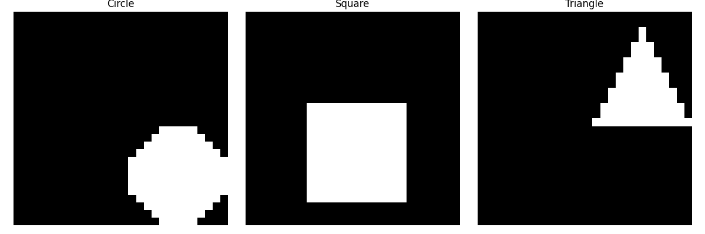

# DSAIT-4205 Control Dataset

Razo van Berkel, June 2025
DSAIT 4205, TU Delft, Fundamental Research in Machine and Deep Learning



> **Assignment 2:** create a precise control-dataset to evaluate a single hypotheses of a ML/DL paper.

## Paper on-test: Learning Optimal Conformal Classifiers

Paper link: <https://github.com/google-deepmind/conformal_training/>

Conformal Training is best described by the authors themselves, in the [README of their GitHub repository](https://github.com/google-deepmind/conformal_training/blob/main/README.md): \
> _*Conformal training* allows training models explicitly for split conformal prediction (CP). Usually, split CP is used as a separate calibration step - a wrapper - after training with the goal to predict _confidence sets_ of classes instead of making point predictions. The goal of CP is to associate these confidence sets with a so-called coverage guarantee, stating that the true class is included with high probability. However, applying CP _after_ training prevents the underlying model from adapting to the prediction of confidence sets. Conformal training explicitly differentiates through the conformal predictor during training with the goal of training the model with the conformal predictor end-to-end. Specifically, it "simulates" conformalization on mini-batches during training. Compared to standard training, conformal training reduces the average confidence set size (inefficiency) of conformal predictors applied after training. Moreover, it can "shape" the confidence sets predicted at test time, which is difficult for standard CP. We refer to the paper for more background on conformal prediction and a detailed description of conformal training._

## Hypothesis

We design a dataset to test the following hypothesis:
> _"ConfTr reduces the disparity in inefficiency between majority and minority classes."_

A bit more complete and descriptive statement of the hypothesis:
> _Given strong class-imbalance, Conformal Training (ConfTr) produces confidence sets whose **inefficiency disparity** across classes is smaller than that of a baseline model trained with standard cross-entropy and calibrated with split conformal prediction._

### Why this matters  

* Split-conformal guarantees nominal coverage _marginally_, but the **size** of the returned confidence set |S| can vary wildly between majority and minority classes.  
* A lower disparity (fairer uncertainty allocation) is desirable in safety-critical or regulated domains. ConfTr claims to shape confidence sets during training—this experiment isolates that claim.

### Control dataset design  

The control dataset consists of three isotropic Gaussian blobs in ℝ² representing square, triangle, and circle classes. The means of these blobs form an equilateral triangle with side-length _d ≈ 6_ (e.g., μ₁=(0,0), μ₂=(6,0), μ₃=(3, 3√3)), and they share a covariance matrix Σ = I₂, resulting in negligible overlap and a base Bayes error close to 0. The class priors are set as π = {0.80, 0.15, 0.05}, and the total sample size is 10,000, split into 60% for training, 20% for calibration, and 20% for testing. This ensures that even the minority classes have sufficient samples for reliable per-class estimates. During development we cap the total number of samples to 200, to save bandwidth on the Git. Please refer to the later section to see how to adjust this yourself.

### Evaluation protocol & metrics  

The evaluation involves two models: a baseline trained with cross-entropy followed by split-CP calibration, and ConfTr, which uses an identical backbone but incorporates a differentiable split-CP loss. Metrics are computed on the test split with α = 0.05, including per-class inefficiency \(\bar{s}_k = \tfrac{1}{n_k}\sum_{i\in k}|S_i|\), disparity measured as the standard deviation \(σ(|S|)\) across the three \(\bar{s}_k\), and optionally the Gini coefficient of the \(\bar{s}_k\). Overall coverage is also reported to ensure both models maintain approximately 95% coverage. The success criterion is defined as ConfTr achieving **Δdisparity < 0**, indicating a smaller spread of \(\bar{s}_k\) compared to the baseline while preserving coverage. This minimal, well-separated 2-D setup eliminates confounders such as overlap and label noise, ensuring that any observed reduction in disparity is attributable to the training objective rather than data complexity.

## Code & Replication

The script to generate this data was written in Python. We use `uv` as the package manager in this setup. If you haven't installed `uv` yet, please refer to their official documentation on <https://docs.astral.sh/uv/getting-started/installation/>.

### Installating and running the code

To replicate the control dataset, run the following commands in your terminal (PowerShell or Bash):

```bash
uv venv
uv sync
uv run src/main.py
```

This will create a virtual environment, install the required dependencies, and run the main script to generate the control dataset.

### Adjustable parameters

The following parameters may be adjusted in the `src/main.py` script to modify the control dataset structure (defaults added):

```python
image_size: int = 28 # Size of the generated images (28x28 pixels)
edge_bounding_box: int = 12 # Size of the bounding box around the blobs
n_total: int = 200 # Total number of samples
priors: np.ndarray = np.array([0.80, 0.15, 0.05])
```

## Acknowledgements

Generative AI (ChatGPT o3) was used as a sparring partner for defining the hypothesis to test.
