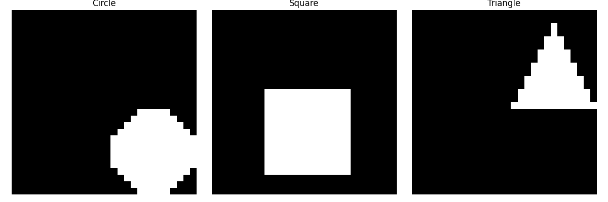

# Conformal Training on an Imbalanced Shape Dataset: Testing Inefficiency Disparity

_Razo van Berkel, June 2025.
DSAIT 4205, TU Delft, Fundamental Research in Machine and Deep Learning._

The following is the blogpost for the control dataset as created to test a single Hypothesis on the "Learning Optimal Conformal Classifiers" paper. The source code can be found on [GitHub](https://github.com/thekaasking/dsait4205-control-dataset), and instructions to replicate the dataset are provided in the "Code & Replication" section in the [README of the repository](https://github.com/thekaasking/dsait4205-control-dataset/blob/main/README.md).

## Introduction

Re-creating someone else’s experiment only pays off if we can be sure the data are not secretly steering the outcome... To isolate the effect of Conformal Training (ConfTr) on class-wise inefficiency, I built a deliberately simple "control" dataset of 28 x 28 black-and-white shapes—circles, squares, and triangles—whose class priors mirror a heavy 80 / 15 / 5 imbalance. The three classes are linearly separable in latent space, so any boost (or lack thereof) in fairness can be attributed to the training objective, not to overlap, label noise, or sampling artefacts. By fixing everything except the learning algorithm, we obtain a clean A/B test for the claim that ConfTr narrows the gap in uncertainty between majority and minority classes.

### Paper on-test: Learning Optimal Conformal Classifiers

> Paper link: [OpenReview.net PDF Link](https://openreview.net/pdf?id=t8O-4LKFVx)

Conformal Training is best described by the authors themselves, in the [README of their GitHub repository](https://github.com/google-deepmind/conformal_training/blob/main/README.md):
_*Conformal training* allows training models explicitly for split conformal prediction (CP). Usually, split CP is used as a separate calibration step - a wrapper - after training with the goal to predict _confidence sets_ of classes instead of making point predictions. The goal of CP is to associate these confidence sets with a so-called coverage guarantee, stating that the true class is included with high probability. However, applying CP _after_ training prevents the underlying model from adapting to the prediction of confidence sets. Conformal training explicitly differentiates through the conformal predictor during training with the goal of training the model with the conformal predictor end-to-end. Specifically, it "simulates" conformalization on mini-batches during training. Compared to standard training, conformal training reduces the average confidence set size (inefficiency) of conformal predictors applied after training. Moreover, it can "shape" the confidence sets predicted at test time, which is difficult for standard CP. We refer to the paper for more background on conformal prediction and a detailed description of conformal training._

### Hypothesis

We design a dataset to test the following hypothesis:
> _"ConfTr reduces the disparity in inefficiency between majority and minority classes."_

A bit more complete and descriptive statement of the hypothesis: _Given strong class-imbalance, Conformal Training (ConfTr) produces confidence sets whose **inefficiency disparity** across classes is smaller than that of a baseline model trained with standard cross-entropy and calibrated with split conformal prediction._

### Why this matters  

* Split-conformal guarantees nominal coverage _marginally_, but the **size** of the returned confidence set |S| can vary wildly between majority and minority classes.  
* A lower disparity (fairer uncertainty allocation) is desirable in safety-critical or regulated domains. ConfTr claims to shape confidence sets during training—this experiment isolates that claim.

### Control dataset design  

The control dataset consists of three isotropic Gaussian blobs in ℝ² representing square, triangle, and circle classes. The means of these blobs form an equilateral triangle with side-length _d ≈ 6_ (e.g., μ₁=(0,0), μ₂=(6,0), μ₃=(3, 3√3)), and they share a covariance matrix Σ = I₂, resulting in negligible overlap and a base Bayes error close to 0. The class priors are set as π = {0.80, 0.15, 0.05}, and the total sample size is 10,000, split into 60% for training, 20% for calibration, and 20% for testing. This ensures that even the minority classes have sufficient samples for reliable per-class estimates. During development we cap the total number of samples to 200, to save bandwidth on the Git. Please refer to the later section to see how to adjust this yourself.

### Evaluation protocol & metrics  

The evaluation involves two models: a baseline trained with cross-entropy followed by split-CP calibration, and ConfTr, which uses an identical backbone but incorporates a differentiable split-CP loss. Metrics are computed on the test split with α = 0.05, including per-class inefficiency \(\bar{s}_k = \tfrac{1}{n_k}\sum_{i\in k}|S_i|\), disparity measured as the standard deviation \(σ(|S|)\) across the three \(\bar{s}_k\), and optionally the Gini coefficient of the \(\bar{s}_k\). Overall coverage is also reported to ensure both models maintain approximately 95% coverage. The success criterion is defined as ConfTr achieving **Δdisparity < 0**, indicating a smaller spread of \(\bar{s}_k\) compared to the baseline while preserving coverage. This minimal, well-separated 2-D setup eliminates confounders such as overlap and label noise, ensuring that any observed reduction in disparity is attributable to the training objective rather than data complexity.

### Conclusion

This toy dataset might look trivial, but it could act as a magnifying glass: any unfairness introduced by the model stands out because the data themselves are impartial. With this control set in place we can now run ConfTr and a standard cross-entropy baseline, calibrate both with split CP, and compare per-class inefficiency at identical 95% coverage. If ConfTr truly levels the playing field, the disparity metric \(σ(|S|)\) should fall; if it doesn’t, the claim weakens under the simplest possible conditions. Either way, the experiment yields an unambiguous answer while requiring only seconds to generate and a few megabytes—not gigabytes—of storage, making it easy for anyone to reproduce or extend the study.
